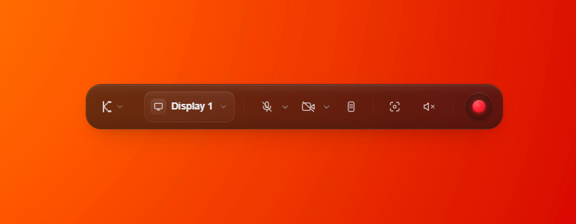
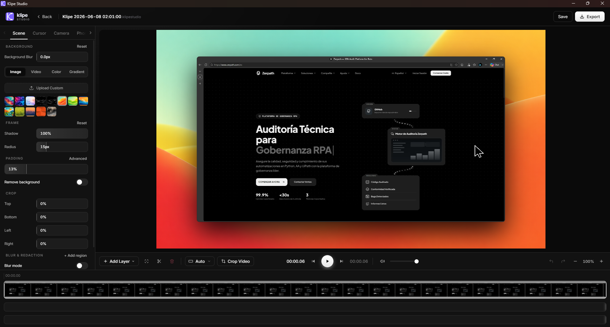
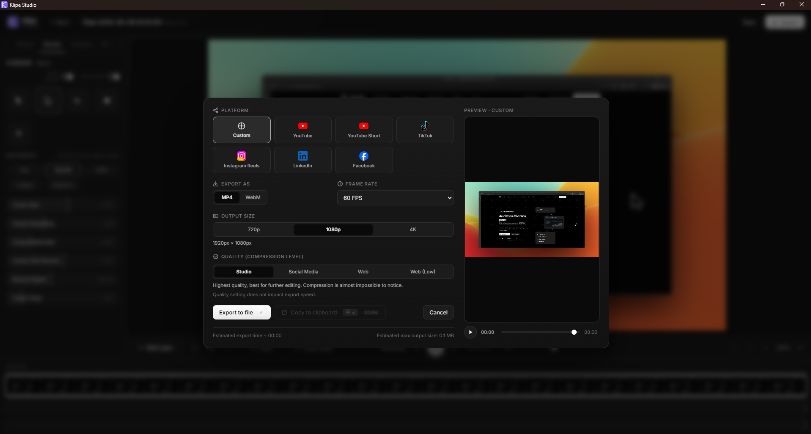
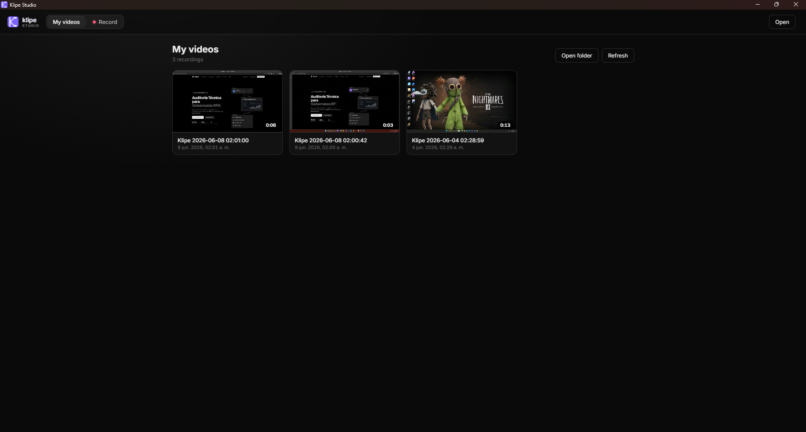

<div align="center">

English | [Español](README.es.md)

<picture>
  <source media="(prefers-color-scheme: dark)" srcset="docs/media/klipe-logo-dark.svg">
  
</picture>

<br/><br/>

[](#installation)
[](LICENSE)
[](https://github.com/jcurotto-c/Klipe-Studio/releases/latest)
[](https://github.com/jcurotto-c/Klipe-Studio/releases)

### Record. Zoom. Polish. Ship — fully open source, 100% local.

A Windows **screen recorder and cinematic editor** with automatic zoom-on-click,
smooth cursor, beautiful backgrounds, a webcam bubble and Android phone mirroring —
in the spirit of Screen Studio, but for Windows.

[](https://github.com/jcurotto-c/Klipe-Studio/releases/latest/download/Klipe-Studio-Setup.exe)

<video src="https://github.com/user-attachments/assets/aac24b6c-8c93-4e42-8f38-680ed02964e0" width="820" controls></video>

</div>

---

## What is Klipe Studio?

Klipe Studio records your screen (or an Android phone) and turns raw captures into
polished, motion-driven product videos — automatic zoom on clicks, a buttery-smooth
rendered cursor, cinematic camera moves, styled backgrounds, a webcam bubble, title
cards and on-device captions. Think **Screen Studio**, but for Windows and fully
open source.

Everything runs **locally**: no backend, no telemetry, no uploads. Export uses your
GPU's hardware encoder via WebCodecs — not FFmpeg.wasm.

> **Platform:** Windows 10 (build 19041+) or Windows 11, x64. Screen capture uses
> native **Windows.Graphics.Capture**; system audio uses **WASAPI** loopback.

> **Stack:** Electron · React · Vite · TypeScript · PixiJS · WebCodecs + [mediabunny](https://www.npmjs.com/package/mediabunny) · scrcpy (phone capture) · transformers.js (on-device Whisper)

---

## Core features

### 🎯 Automatic zoom & cinematic camera-follow
Klipe watches your clicks, typing bursts and cursor-type changes and **zooms in
automatically** at the right moments — no manual keyframing. Add or tweak **manual
zoom segments** with per-segment scale, easing and focus point, then let the
**camera follow** the cursor with `static`, `follow` (safe-zone) or `cinematic`
(floaty springs + look-ahead) behaviour.

<!-- Add demo: docs/media/feature-zoom.gif — auto-zoom + camera follow -->

### 🖱️ Cursor polish
The recorded cursor is **re-rendered**, not captured — so it can be smoothed, resized
and restyled after the fact: multiple cursor styles, motion blur, click bounce and
velocity-based sway. The live preview cursor sits on a **content-protected overlay**,
so the real OS cursor never bleeds into the capture.

<!-- Add demo: docs/media/feature-cursor.gif — cursor polish -->

### 🎨 Beautiful backgrounds, framing & webcam bubble
Drop your recording onto **wallpapers, gradients, solid colors, custom images or a
looping video background**, with adjustable blur, corner radius, padding and frame
shadow. Add a **webcam bubble** anywhere on a 9-position grid (circle, card or pill),
mirrored and resizable, that can even shrink while zoomed.

<!-- Add demo: docs/media/feature-background.gif — backgrounds / framing / webcam -->

### 📱 Android phone mirroring
Record an Android device — over USB — straight into Klipe via bundled **scrcpy + adb**
(downloaded and integrity-checked automatically), composited inside an on-screen
**phone frame** (iPhone, Dynamic Island or Galaxy).

<!-- Add demo: docs/media/feature-phone.gif — phone mirroring -->

---

## All features

### Recording
- Record an entire display or a single window (Electron `desktopCapturer` / `getDisplayMedia`).
- Microphone **and** system/desktop audio (WASAPI loopback) as independent tracks.
- **Global input tracking** — mouse moves, clicks and keystrokes captured at the OS
  level by a Win32-backed PowerShell helper (`GetCursorPos` / `GetAsyncKeyState` /
  `GetCursorInfo`). No native modules to compile.
- Webcam capture as a separate track.
- Android phone mirroring via bundled scrcpy + adb.
- Every recording **auto-saves** to your library ("My videos" gallery).

### Editing & timeline
- Multi-fragment timeline: trim, cut/split, reorder, click markers, scrubbable playhead.
- Real-time PixiJS + WebCodecs preview.
- Reopen any past project from the library; undo/redo.

### Zoom & camera
- Automatic zoom from clicks, typing bursts and UI-focus cursor types.
- Manual zoom segments — center point, scale, duration, ease-in/ease-out, zoom blur.
- Camera-follow modes: `static`, `follow` (safe-zone), `cinematic`.

### Cursor
- Show/hide, loop, size (0.5×–5×), multiple styles.
- Smoothing, motion blur, click bounce and sway, plus one-click movement presets.

### Backgrounds & framing
- Wallpaper presets + custom uploads, gradients, solid colors, **video backgrounds**.
- Background blur, frame shadow, corner radius, padding.
- Source crop with optional aspect lock; `fit` vs `fill` modes.

### Webcam bubble
- 9-position grid · circle / card / pill shapes · size, roundness, mirror.
- Optional different size while zoomed.

### Overlays, title cards & captions
- Text & image **overlays** with PixiJS animations (fade, rise, zoom, blur, typewriter)
  and per-overlay keyframes.
- **Intro / outro / mid-roll title cards**, including a parametric **Reveal** template
  (cascading images + title + callout labels), with fade transitions.
- **Captions** generated **on-device** by Whisper (transformers.js, runs in a Web
  Worker — no API key, no cloud), auto-detect or pick a language, fully styleable.

### Audio
- Independent mic + system-audio volumes.
- Generated **click / keystroke sound effects** (auto / on / off).
- Looping **background music** with fade-in / fade-out.

### Blur / redaction
- Rectangle or ellipse regions, gaussian blur or pixelate, with **keyframed**
  position and size to track moving content.

### Export & sharing
- **MP4 (H.264)** or **WebM (VP9)** via the OS hardware encoder (WebCodecs).
- 720p / 1080p / 4K, 30 or 60 fps, quality presets.
- Aspect ratios + **platform presets** (YouTube, Shorts, TikTok, Reels, LinkedIn,
  Facebook) with safe-zone guides.

---

## Screenshots

The floating recorder bar — drop it on any background:

<p align="center">
  
</p>

The editor — timeline, auto-zoom, cursor, backgrounds, title cards &amp; captions:

<p align="center">
  
</p>

Export with platform presets, and your auto-saved recordings library:

<p align="center">
  
  
</p>

---

## How export works

Klipe Studio uses a modern, hardware-accelerated pipeline — **not** FFmpeg.wasm:

1. The source recording is demuxed by **mediabunny** and decoded by a WebCodecs
   `VideoDecoder` (hardware-accelerated where the OS/GPU allows).
2. Each decoded frame is composited on a canvas with all effects baked in —
   cinematic zoom, cursor, blur regions, overlays, title cards, captions.
3. Frames are fed to a WebCodecs `VideoEncoder` (H.264 / VP9) and muxed by
   mediabunny with faststart, so the output is streamable.
4. Audio (source track + sound FX + background music) is mixed offline via an
   `OfflineAudioContext`.

On Windows this maps to **Media Foundation** for encode/decode — the same
"use the OS codec" approach Screen Studio takes with VideoToolbox on macOS.

---

## Installation

### Download (recommended)

Grab the latest Windows installer from **[Releases](https://github.com/jcurotto-c/Klipe-Studio/releases/latest)**,
or the stable direct link:

➡️ **[Klipe-Studio-Setup.exe](https://github.com/jcurotto-c/Klipe-Studio/releases/latest/download/Klipe-Studio-Setup.exe)**

> [!IMPORTANT]
> The installer is **not code-signed** yet, so Windows SmartScreen may warn you.
> Click **More info → Run anyway** to continue. The app auto-updates from GitHub
> Releases after the first install.

### Build from source

**Requirements:** [Node.js](https://nodejs.org) 18+, [pnpm](https://pnpm.io) 11+
(`corepack enable` provides the pinned version), PowerShell (built-in). For phone
mirroring you also need an Android device with **USB debugging** enabled — scrcpy/adb
are downloaded automatically on install.

```bash
pnpm install    # also runs postinstall → downloads + verifies scrcpy/adb
pnpm dev        # boots Vite (renderer) and Electron together with HMR
pnpm build      # typecheck → vite build → electron build → NSIS installer (release/)
```

If Electron exits before Vite is ready on the first launch, just rerun `pnpm dev`.
This project uses **pnpm** (not npm).

---

## System requirements

| Component   | Minimum                              | Notes                                            |
| ----------- | ------------------------------------ | ------------------------------------------------ |
| OS          | Windows 10 (build 19041+) or 11, x64 | Uses Windows.Graphics.Capture + WASAPI loopback  |
| Node.js     | 18+                                  | Development only                                  |
| pnpm        | 11+                                  | Development only (`corepack enable`)             |
| PowerShell  | Built-in                             | Powers the global mouse/key tracker              |
| Android     | Optional                             | USB debugging on, for phone mirroring (scrcpy)   |

---

## Usage

1. **Record** — start from the floating HUD. Pick a display or window, toggle
   microphone, system audio, webcam or a connected phone, and leave auto-zoom on.
2. **Edit** — Klipe jumps straight into the editor. Tune zoom segments, cursor,
   background & framing, webcam bubble, blur regions, title cards and captions on
   the timeline, with a live preview.
3. **Export** — choose resolution, frame rate, format and a platform preset, then
   render to MP4 or WebM. Every project also auto-saves to your library.

---

## Privacy

All processing is local. Klipe Studio has no telemetry, makes no network calls during
recording or export, and uploads nothing. The on-device caption model is downloaded
once from Hugging Face and then runs entirely offline.

---

<details>
<summary><b>Project layout</b></summary>

```
klipe-studio/
├── electron/              # Electron main process
│   ├── main.ts            # windows, IPC, PowerShell mouse/key tracker, file save
│   ├── preload.ts         # contextBridge → window.klipe / klipeHud / previews
│   ├── scrcpy-bridge.ts   # Android mirroring via scrcpy + adb
│   └── cursorHider.ts     # blanks the OS cursor during capture (Win32)
├── src/                   # Renderer (React + Vite)
│   ├── App.tsx            # Library ↔ Recorder ↔ Editor router
│   ├── components/        # RecorderView, EditorView, LibraryView, Timeline, panels/
│   ├── lib/               # Engines: renderer, exporter, zoom-engine, cursor-engine, …
│   ├── cards/             # Intro/outro/mid-roll title cards + Reveal template
│   ├── overlays/          # PixiJS text/image overlay + caption system
│   └── types/             # Shared TypeScript types + window.klipe typings
├── scripts/               # download-scrcpy.cjs (postinstall), build helpers
├── public/                # wallpapers, sound effects
└── binaries/              # scrcpy / adb / FFmpeg DLLs (auto-downloaded; not in git)
```

</details>

<details>
<summary><b>Scripts</b></summary>

| Command              | What it does                                               |
| -------------------- | ---------------------------------------------------------- |
| `pnpm dev`           | Vite + Electron together, with HMR                         |
| `pnpm build`         | Typecheck, build the renderer, package a Windows installer |
| `pnpm release`       | Build and publish a versioned GitHub Release               |
| `pnpm preview`       | Vite preview (renderer only, no Electron)                  |
| `pnpm typecheck`     | `tsc --build` across all tsconfigs                         |
| `pnpm setup:scrcpy`  | Re-download and verify the scrcpy/adb binaries             |
| `pnpm audit:check`   | `pnpm audit --audit-level=high`                            |

</details>

---

## Contributing

Contributions are welcome — see [CONTRIBUTING.md](CONTRIBUTING.md). By contributing
you agree your changes are licensed under the project's GPL-3.0-or-later license.

---

## License

Klipe Studio is free software licensed under the **GNU General Public License v3.0 or
later** — see [LICENSE](LICENSE). You may use, study, share and improve it; any
distributed version (including forks and modifications) must remain open source under
the same license.

Bundled third-party binaries (scrcpy, FFmpeg, SDL2, libusb, adb) are distributed under
their own licenses — see [THIRD-PARTY-NOTICES.md](THIRD-PARTY-NOTICES.md).

---

## Acknowledgements

- **[Screen Studio](https://screen.studio)** — the inspiration for the whole approach.
- **[scrcpy](https://github.com/Genymobile/scrcpy)** — Android display mirroring.
- **[mediabunny](https://www.npmjs.com/package/mediabunny)** — WebM/MP4 demux & mux.
- **[PixiJS](https://pixijs.com)** — overlay & caption rendering.
- **[transformers.js](https://github.com/huggingface/transformers.js)** — on-device Whisper captions.
